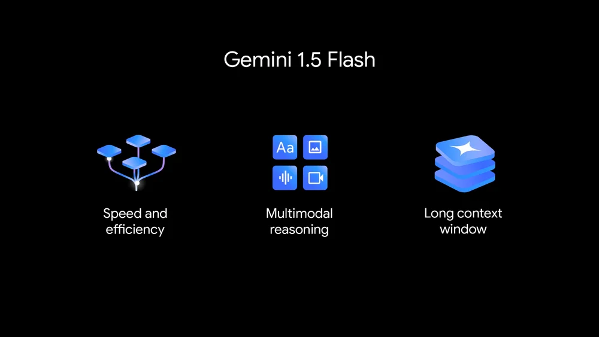
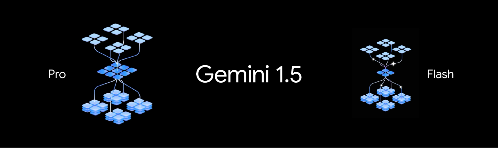

import Comments from 'components/Comments';
import Tweet from 'components/Tweet';



Back at University in 2019, I still remember taking the phone and going for a walk,
just to get the circle to complete on [Google Fit](https://www.google.com/fit/).
These numbers albeit not necessarily precise to the point,
but surely gave a burst of happiness and was a good ballpark.
Skip ahead to 2022, when I got a Fitbit, I ended up using a
third-party app - [FitToFit](https://play.google.com/store/apps/details?id=fitapp.fittofit), just
to sync the data, until Google launched
[Health Connect](https://health.google/health-connect-android/).

While it has been a couple of years since the advent of enormously capable AI models,
I didn't dabble with it much. When [Gemini Flash](https://deepmind.google/technologies/gemini/flash/) was
announced, what intrigued me the most was the benchmarks which showcased performance nearly at par with the
grandest model from Google - Gemini 1.5 Pro, cost-efficiently.
This seemed too good to be true, which squeezed the best of both worlds.

The same has been attested by Large Model Systems Organization through their Chatbot Arena.

<Tweet>
	<p lang="en" dir="ltr">
		Big news – Gemini 1.5 Flash, Pro and Advanced results are out!🔥
		<br />
		<br />
		- Gemini 1.5 Pro/Advanced at #2, closing in on GPT-4o
		<br />
		- Gemini 1.5 Flash at #9, outperforming Llama-3-70b and nearly reaching GPT-4-0125 (!)
		<br />
		<br />
		Pro is significantly stronger than its April version. Flash’s cost,…
		<a href="https://t.co/zekXBVYQlC">pic.twitter.com/zekXBVYQlC</a>
	</p>
	&mdash; lmsys.org (@lmsysorg)
	<a href="https://twitter.com/lmsysorg/status/1795512202465845686?ref_src=twsrc%5Etfw">May 28, 2024</a>
</Tweet>

## The Beauty

Little did I know that I walked the most on Saturdays, followed by Tuesdays.
Gemini unravelled that the year 2023, is the year I walked the most.
Sure, I could have clicked a few clicks and engaged in some keystrokes to get it.

The data dump comprised thousands of files.
Instead of manually trying to understand the purpose and format of each file, Gemini was able to interpret the data.
I could go from downloading a `zip` file to understanding folder structure,
data format and the purpose of each file in less than 10 minutes.

As of present, although Gemini when used via [AI Studio](https://ai.google.dev/aistudio)
or [Vertex AI](https://console.cloud.google.com/vertex-ai/publishers/google/model-garden/gemini-1.5-flash-001),
is multimodal in its input, its output is text. The text format seems to be a constraint
until you try pushing the boundary. It can output code, markdown, paragraphs, bullet points, tables, JSON, etc.

I needed to plot a graph of the analysed data. The right set of prompts
gave data in a table format, which I could copy and paste into Excel to get the chart drawn.
It could even provide a code snippet in your language of choice to generate your request.

I ensured to use some of the following phrases across the prompts and
system instructions to get the desired results.

- Please provide the answer as a CSV that I can copy-paste into Excel.
- Provide a script to graph the data using JavaScript.
- In a case, where you want the output to be of a specific format,
  Gemini may provide you with a script to convert data to your required format.
  This may be frustrating as you want the outcome, but Gemini instead is giving instructions.
  In such case, you can try adding - _"Please do not provide output as code, provide data as a table"_
  or similar as per your need to the system instruction section.

## Magic Inside



Gemini Flash promises the best price-to-general intelligence ratio among all other models
and supports a 1M tokens context window.
It is best suited for high-volume tasks in latency-sensitive applications.

This finesse was made possible through prior powerful AI models like - Gemini 1.5 Pro.
This is achieved through Knowledge Distillation, which is outlined and explained in detail by
_Rubens Zimbres_ in the blog - [Multimodality with Gemini-1.5-Flash: Technical Details and Use Cases](https://medium.com/@rubenszimbres/84e8440625b6)

### Getting Data For Experiments

For my exploration with Gemini Flash, I used [Google Takeout](https://takeout.google.com/) to export my Google Fit data.
The data is formatted in structured format making it ready for analysis.
I plan to use the same service for future purposes as well.

> Google Takeout is a goldmine of your data, ready for your adventures.

## Safety Filters?

While Large Language Models (LLMs) tend to generate output that may seem deceiving, AI models
like Gemini Flash have a couple of safety nets for the protection of the users.

I was happy and surprised to see
the model have such a level of safety. There is a lot under the hood of these
gigantic models, and what one observes may be just a subset, while the rest remain unseen.

- As I was analysing my walking history, I asked Gemini to compute my highest walking speed.
  In the outcome, it messed up and gave me my top speed of 427 kilometres per hour. 🤯

  But there was a note at the end that said - _"Please check the computed speed as it is too high for a human"_.
  This shows that there are layers of safety baked in.

- In the exported data, there were a couple of months' data missing.
  When I asked Gemini to provide a monthly analysis of the data,
  it was prudent enough to call out that - _"Exported data seems to be incomplete.
  Data for the months of February and March 2023 is missing"_.

## Caveats and Tips

LLMs are a whole different spectrum of tools that shine when used for their intended purpose.
While they can do a lot, I believe that -

> If you know exactly what you want and the methodology for it, you pretty much have the solution.
> Here LLM-based AI models are tailwinds accelerating your pace in your workflow - like
> GitHub Copilot or Gemini Code Assist.

> If you have some perception of the outcome, but are unclear on the path towards it, LLM-based AI models
> can act as your partner in crime.

As the models evolve, a few of the suggestions here may lose relevance.
It's always best to test for your specific use case to get a feel for the outcome.

- As these models charge basis the number of tokens,
  be sure to test the outcome with smaller datasets and tune it to your liking
  before a full-fledged experiment.

- If your input dataset comprises multiple files, it is best to merge it.
  This leads to finer outcomes from the model, as well as better performance for the object storage like GCP Cloud Storage.
  If it is a text-based file, you can directly `cat` (concatenate) like below.

  ```sh
  # Merge all files with names starting with 2019
  cat 2019*.txt > 2019_MERGED.txt
  ```

- To ensure outcomes do not diverge over time, regenerate for your input and prompt multiple times.
  This would provide you with a sense of the range of outcomes.

- Hallucination could be a bane or boon, and it depends on the use case.
  Depending on your accuracy requirement, ensure to have a reconciliation mechanism outside of an LLM.

- I observed that the model gives a very refined output when the input dataset is a JSON file.
  When the same task was tried in CSV and JSON input format, the JSON input performed better.

- Be as crisp as possible in the expected output format.
  You do not want to end up spending time and tokens to get data in a format that does not fit you.

## Thank You

- ✨[Google Cloud Champion Innovators](https://cloud.google.com/innovators/champions) Program supported this work✨
- Images are taken from blogs by Google.

<Comments />
